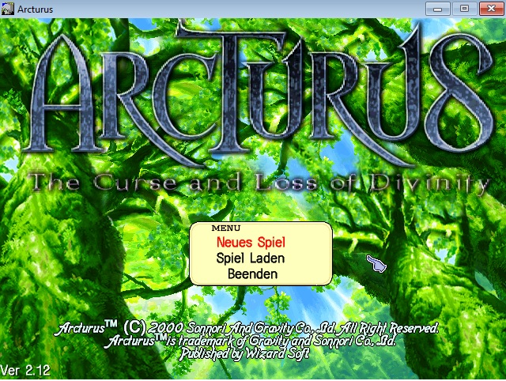
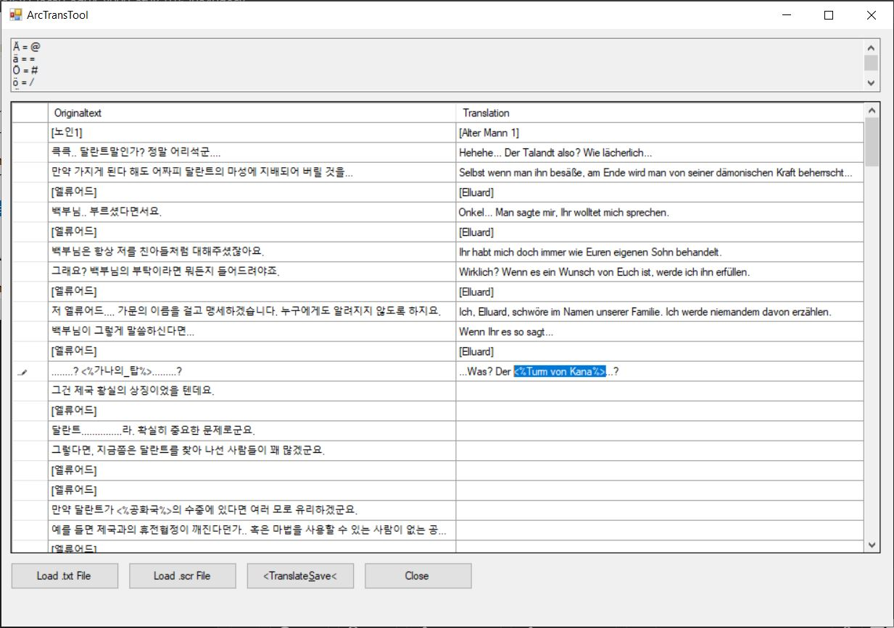
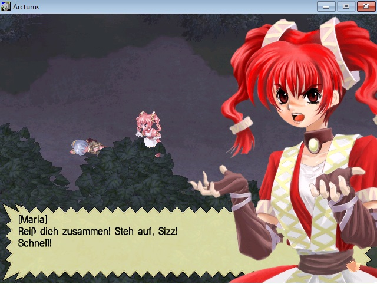
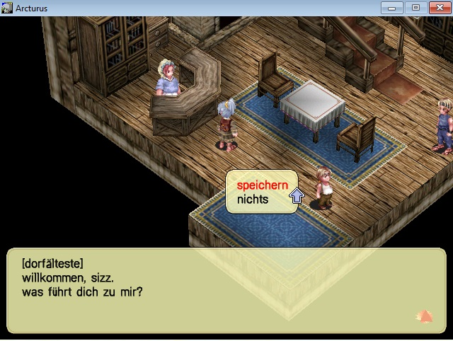
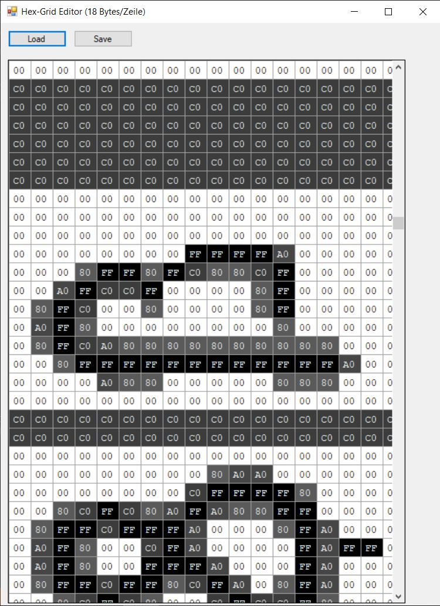

# Arcturus-Curstom-Translation-Tools
Any Translation of Arcturus: The Curse and Loss of Divinity (Korean 2 Disc Version)





# 🌐 Arcturus Translation Project

Since the English Translation based on the japanese version of **Arcturus** became available in 2017, this repository aims to provide the same opportunity for players of the **original Korean version** — starting with a **German translation** as an example.

This project also serves as a **step-by-step guide** to help you translate the game into other languages, such as **French, Spanish**, and beyond.



---

## 🛠 Tool-List

`GrfUnpack` to unpack data.pak 
[GrfUnpack](https://github.com/exectails/GrfUnpack.git)

`Notepad++` to edit translateable files 
[Notepad++](https://notepad-plus-plus.org/downloads/)

`dbaf14's Arcturus Translation Tool` to edit translateable files in a comfy way
[dbaf14's ArctransTool](arctranslationtool)

`dbaf14's Arcturus Fonttool` to edit arcfonte.dat or other arcfont-dat-files 
[dbaf14's Arcturus Fonttool](fontedit)

`decrsa/encrsa` to decrypt/encrypt RSA-files
[Arcturus decrsa/encrsa](https://cyberwarriorx.com/translation-utilities)

---

## 📁 Which Files Need to Be Edited?

To localize Arcturus, you'll primarily work with the contents of the `data.pak` file, located in the **root directory** after installation. Additionally, some menus in `Arcexe.exe` can be modified using a **hex editor**.

You can **fully unpack `data.pak`** using a special version of **GrfWiz.exe** or [GrfUnpack](https://github.com/exectails/GrfUnpack.git).

### Key File Types:

- **`.SCR`** – Scripts for NPC movements, item behavior, dialogues, etc.  
  Not encrypted; editable by replacing the text directly.

- **`.TXT`** – Plain text databases (e.g., skills, maps, items).  
  Simple text replacement possible.

- **`.DAT`** – Specifically `arcfont.dat`, `arcfonte.dat`, and `arcfonth.dat`.  
  These files contain all displayable characters. For Western languages, edit `arcfonte.dat` to enable special characters.  
  The others contain Korean Hangul and Chinese Hanja characters.

- **`.RSA`** – Contains cutscene dialogue and events for protagonists and NPCs.  
  These are **encrypted** and must be decrypted before editing and encrypted again afterward.

For `.RSA` files, use [Arcturus decrsa/encrsa](https://cyberwarriorx.com/translation-utilities):  
🔧 `DECRSA` (decrypt) & `ENCRSA` (encrypt)

> 📝 *Note: Other file types may also contain text. This list will be updated over time.*

---

## 🛠 How to Edit `.SCR` and `.TXT` Files

The game uses the **EUC-KR encoding**, so use a text editor like [Notepad++](https://notepad-plus-plus.org/downloads/) that supports it to view and edit text properly or [dbaf14's Arcturus Translation Tool](arctranslationtool) (Be sure to have a legend.ini-file next to the executable to use symbol replacement)

In `.SCR` and `.RSA` files, you’ll find text using these commands:

>`say` " text here "

>`monologue` " thought bubble text "

>`shout` " jagged speech bubble text "

>`header` " screen overlay text "


Additional `.SCR` commands:

>`msg` " message box text "

>`choose` "option 1" "option 2"

>`getitem` itemname
> ⚠️ Be careful when renaming items. You can leave the internal ID in Korean and only change the **display name**.

Item names can be edited in:  
`data/diary/item.txt`


> ⚠️ sadly i still dont know how to show Capital Letters ingame using translations in  `SCR`-Files **=(**.

---

## 🔐 How to Edit `.RSA` Files

1. **Decrypt** using the `DECRSA` tool:
   - Drag & drop `test.rsa` onto `decrsa.exe` → Produces `test.txt`
   - Edit `test.txt` with Notepad++ (EUC-KR encoding) or [dbaf14's Arcturus Translation Tool](arctranslationtool) 

2. **Encrypt** using the `ENCRSA` tool:
   ```bash
   c:/tool/encrsa test.txt test.rsa

This will overwrite or create a new test.rsa, which can then be placed back in /data.

🧠 RSA files use the following text triggers as `.SCR` files:

>`say` " text here "

>`monologue` " thought bubble text "

>`shout` " jagged speech bubble text "

>`header` " screen overlay text "


## ✏️ How to Edit `arcfonte.dat` (Font File)

To display **special characters** in Western languages, you’ll need to edit `arcfonte.dat` using a font editor like [dbaf14's Arcturus Fonttool](fontedit) (configured to read 18 bytes per row).

Replace unused characters with your desired special characters.  
Here is a sample character mapping used for the German translation:

| Character | Replaces |
|-----------|----------|
| `@`       | Ä        |
| `=`       | ä        |
| `#`       | Ö        |
| `/`       | ö        |
| `$`       | Ü        |
| `>`       | ü        |
| `+`       | ß        |

> Example:  
To display

> **"Ich heiße Sizz und bin kein Mädchen"**

 , you'd write:
  
> **"Ich hei+e Sizz und bin kein M=dchen"**



### FontEdit Color Codes:
- `00` – Transparent (background)
- `FF` – Black
- `C0` – Dark Gray
- `A0` – Light Gray
- `80` – Very Light Gray

Once finished, save the file and place it in the `/data` directory.  
Note: Not all glyphs/fields in `arcfonte.dat` are used by the game.

## ✏️ How to Use dbaf14's Arcturus Translation Tool

To use [dbaf14's Arcturus Translation Tool](arctranslationtool), simply **load a `.SCR` file** or a **decrypted `.TXT` (RSA) file**, and begin editing the text as needed.

Once you're done, click **`<TranslateSave<`** to write your changes **directly back to the original file**.

> ✅ **Symbol replacement** is handled automatically — just make sure that the `legend.ini` file is placed in the **same directory** as the tool's executable.

🔄 **Only the lines you edit will be written back**, allowing you to translate comfortably without affecting the rest of the file.
